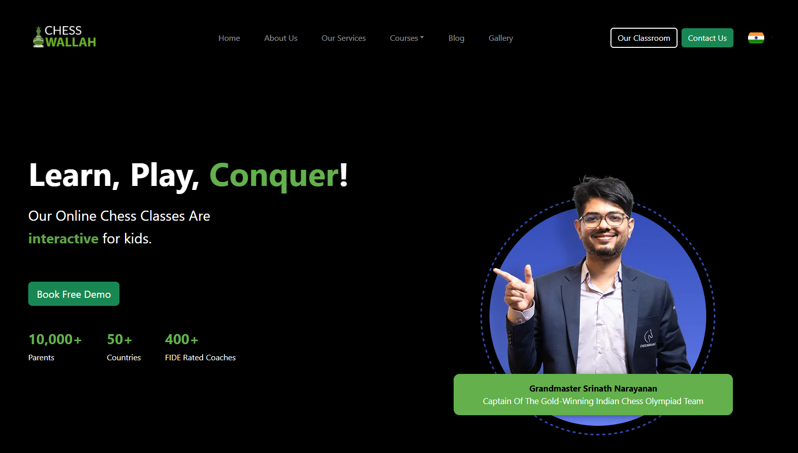

# ♟️ Chess Wallah — Online Chess Coaching Website (Frontend)

> 🚧 **Work in Progress** — This project is currently under development. Stay tuned for updates!

Chess Wallah is a responsive and engaging **frontend website** for an online chess coaching platform. The goal is to provide a modern user experience to parents and students looking for high-quality online chess lessons from certified coaches around the globe.

---

## 🔍 Features (So Far)

- ✅ Glassmorphism-style **Navbar with interactive dropdown**
- ✅ Dynamic **Hero Section** with:
  - Auto-rotating key descriptors (interactive, fun, etc.)
  - Real-time animated stats
  - Prominent chess grandmaster highlight

---

## ✨ Live Preview (Coming Soon)


---

## 📸 Current Preview

### 🧭 Navbar & Hero Section




---

## 🛠️ Tech Stack

- [React.js](https://reactjs.org/)
- [Bootstrap 5](https://getbootstrap.com/)
- Vanilla CSS
- `react-countup` for number animations

---

## 🧪 Status

- Hero and Navbar ✅
- Responsive Adjustments 🔄
- Booking Popup Modal 🔜
- Section-wise Scroll Navigation 🔜
- Footer & Other Pages 🔜

---

## 📁 Setup Instructions

Clone the repo and run:

```bash
npm install
npm start


🙏 Acknowledgements
Figma designs provided by the client.

Grandmaster image is a placeholder and will be replaced with proper attribution.

Inspiration: chessbrainz.com

📌 License
This is a private or client-facing project. Please do not reuse assets without permission.
